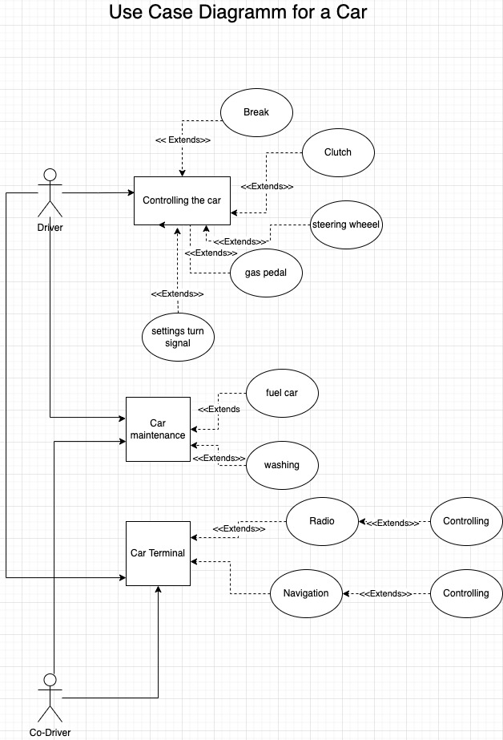
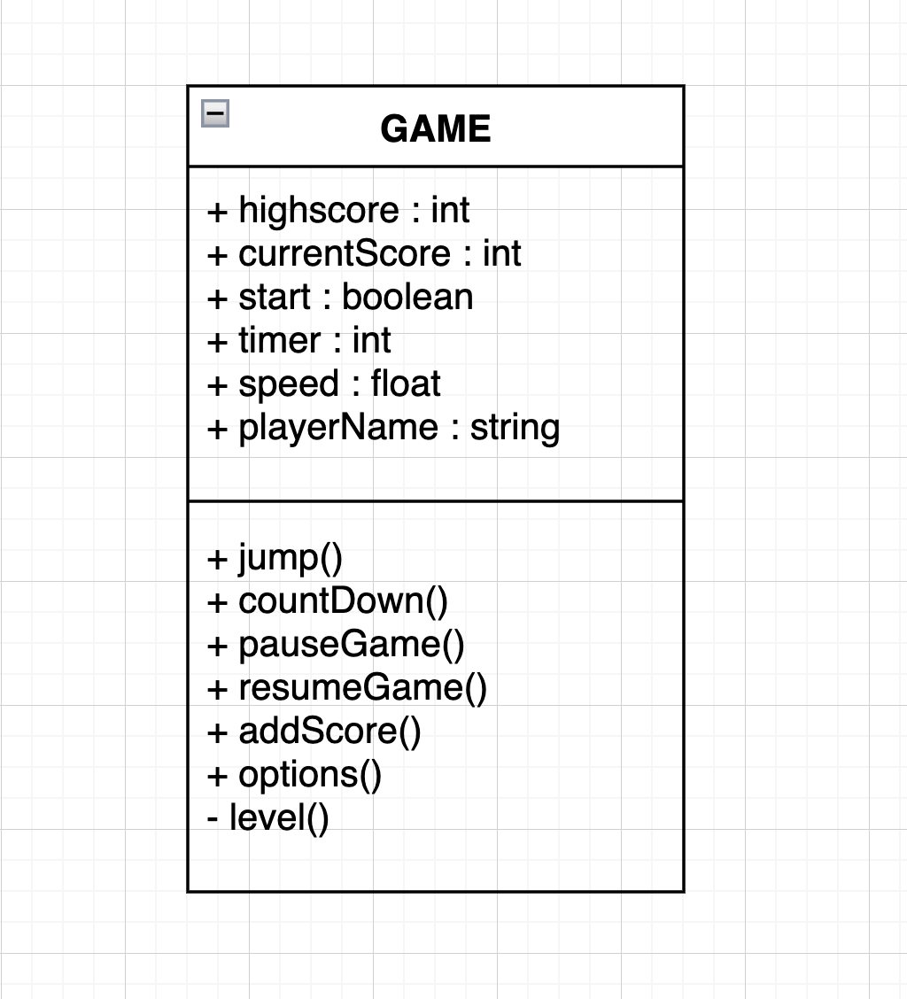

# Nachdenkzettel UML

# Aufgabe 1

# Aufgabe 2

# Aufgabe 3

A Use-Case-Diagramm shows WHO does WHAT in a System meanwhile a class diagramm shows the relations between the different classes of a programm. So with a look on the UCD you can see the needed functions and unite them to different classes.

# Aufgabe 4

Aggregation and composition both describe the relation between two objects. Composition is a special case of aggregation in which one object is necessary for the existence of the other one. e.g.  room —> house (composition)

student —> lecture (aggregation)

# Aufgabe 5

# Aufgabe 6

A public attribute is visible from anywhere in the system.